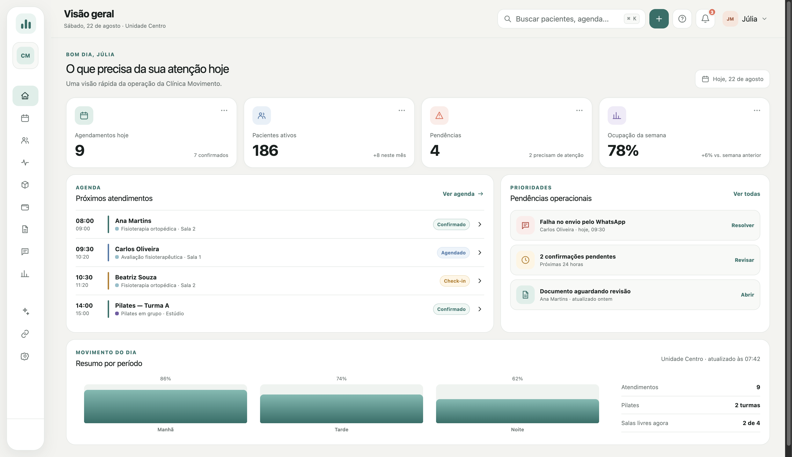
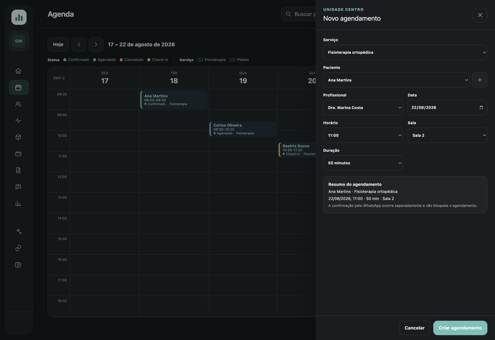

# Movune

**Your clinic in motion.**

Movune is a clinic management platform for physiotherapy and Pilates, currently in the product design and prototyping stage.

The project started from a real need observed in a small physiotherapy and Pilates clinic. After trying different management solutions and struggling to adapt them to its workflow, the initial idea was to explore a system designed around that operation.

What started as a solution for a specific context gradually evolved into a broader product direction, exploring workflows and needs that may also be relevant to other clinics.

The project was initially developed under the working name **FisioFlow** and was later renamed to **Movune**.

> 🚧 Currently in product design and prototyping.

## Origin

The initial context is intentionally small: a single clinic with a single professional managing physiotherapy and Pilates activities.

Instead of starting directly with implementation, the project has been used to explore the operation in more detail through requirements, user flows, interface architecture and prototyping.

This process exposed broader product questions involving areas such as:

- individual physiotherapy appointments;
- collective Pilates classes;
- recurring schedules;
- patient and clinical records;
- packages and session credits;
- financial operations;
- communication and notifications;
- permissions and operational workflows.

As the project evolved, the initial use case became the foundation for exploring a more complete solution that could support different clinic workflows and operational needs.

The current scope reflects that broader direction and will continue to evolve as the project is prototyped, tested and developed.

## Product Preview

### Dashboard

  

### Scheduling

  

## Current Product Direction

The current scope explores:

- Patient management
- Physiotherapy scheduling
- Group Pilates classes
- Clinical records and treatment workflows
- Packages and session tracking
- Financial management
- Documents and reports
- WhatsApp and calendar integrations
- Notifications and workflow automations
- Users, roles and permissions
- Multi-unit support
- Accessibility and interface customization

The scope is still evolving and may change as the prototype is tested and the project moves toward implementation.

## Current Status

- Product scope and workflows defined
- Interface architecture defined
- UI/UX direction established
- Interactive prototype under active development
- Initial use case being refined through prototyping
- Product implementation not yet started

The current prototype is a navigable simulation used to explore workflows, business rules and interface decisions. Backend persistence, production integrations and the complete planned feature set are not yet implemented.

## Development Approach

Movune is also a practical project for exploring **AI-assisted development** throughout the software development process.

AI tools are being used as support for activities such as:

- requirement refinement;
- product and user-flow analysis;
- documentation;
- interface prototyping;
- technical exploration;
- implementation support;
- code review and testing.

The goal is to explore where AI can improve the development workflow while keeping product and engineering decisions under explicit review.

## Roadmap

- [x] Initial problem discovery
- [x] Product definition
- [x] User flows
- [x] Screen architecture
- [x] UI/UX direction
- [ ] Complete navigable prototype
- [ ] Validate the initial workflows
- [ ] Refine product scope
- [ ] Define MVP scope
- [ ] Technical architecture
- [ ] MVP development
- [ ] Automated tests
- [ ] CI/CD
- [ ] Production deployment

The roadmap may evolve as new requirements and insights emerge during prototyping and development.

## Product Documentation

The repository includes public documentation covering the current product direction, workflows and design decisions:

- [Product overview](./docs/product/product-overview.md)
- [Core product flows](./docs/product/core-flows.md)
- [Interface architecture](./docs/product/interface-architecture.md)
- [Design principles](./docs/design/design-principles.md)
- [Brand foundations](./docs/design/brand-foundations.md)
- [Prototype evolution](./docs/design/prototype-evolution.md)

Some documents describe intended product behavior rather than functionality that has already been implemented.

## Project History

The project initially started under the working name **FisioFlow**.

As the product direction, scheduling rules and overall experience evolved, it was renamed to **Movune** and received its own visual identity.

Historical documentation may preserve earlier terminology where relevant to the project's evolution.